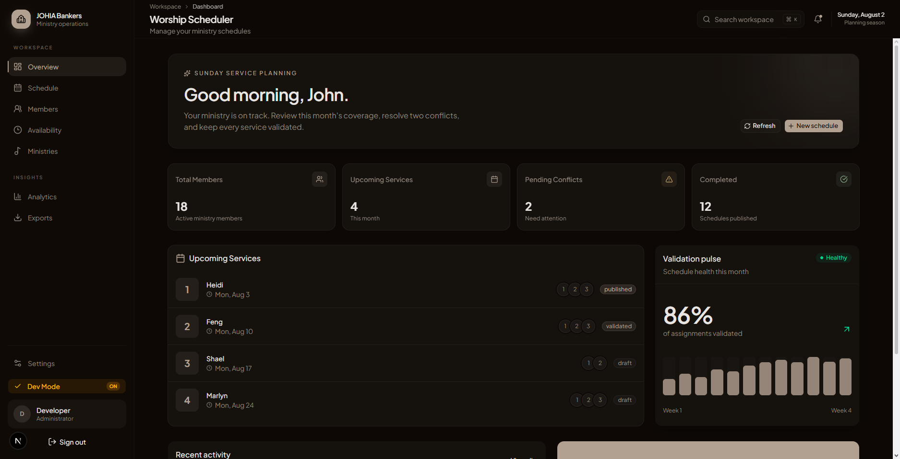

<p align="center">
  
</p>

<h1 align="center">Worship Scheduler</h1>

<p align="center">
  <em>Plan worship services that respect every member's time, availability, and calling.</em>
</p>

<p align="center">
  <a href="https://github.com/Prynxle/worship_scheduler/actions/workflows/ci.yml"></a>
  
  
  
  
  
  
  
  
</p>

---

## Product preview

<table>
  <tr>
    <td>
      
      <p align="center"><strong>Landing page</strong></p>
    </td>
    <td>
      
      <p align="center"><strong>Member sign-in</strong></p>
    </td>
    <td>
      
      <p align="center"><strong>Coordinator dashboard</strong></p>
    </td>
  </tr>
</table>

---

## What it is

Worship Scheduler is a multi-tenant ministry scheduling application for coordinators who need to plan services without violating member availability, workload limits, qualifications, or ministry rules. It brings member and availability management together with schedule generation, validation, replacement suggestions, devotion rotation, fairness analytics, and exports — all in one place.

## What it does

- 🗓️ **Availability-aware scheduling** — services are built around when members are actually available, never the other way around.
- 🎯 **Hard-constraint enforcement** — active status, availability, monthly assignment limits, role qualifications, duplicate-role prevention, backup counts, and exactly one worship leader per service.
- ⚖️ **Fairness built in** — workload is distributed toward an even balance, with warnings for cooldown and leader rotation.
- ✅ **Validation you can trust** — every schedule is checked and classified as critical, warning, or suggestion before publication.
- 🔁 **Smart replacements** — qualified replacement suggestions whenever an assignment conflicts.
- 🙏 **Devotion rotation** — reliable tracking of a sequential devotion roster and assignment history.
- 📊 **Analytics** — dashboards for workload, fairness, availability, and conflict analysis.
- 📤 **Exports** — share schedules easily with your ministry.
- 🔐 **Simple sign-in** — members sign in with their roster name and reach a private workspace with just their own profile and availability.

## Built with

| Layer | Technology |
| --- | --- |
| Framework | Next.js 16 (App Router) · React 19 |
| Language | TypeScript |
| Styling | Tailwind CSS v4 · shadcn/ui · lucide-react |
| Data & auth | Supabase (PostgreSQL, Auth, Row Level Security, triggers, migrations) |
| Data visualization | Recharts |
| Document generation | jsPDF · html2canvas |
| Motion & 3D | GSAP · Motion · three.js |
| Testing | Vitest |
| Deployment | Vercel |

## Architecture

```text
src/app/
├── (auth)/                         Login, registration, password reset
├── (dashboard)/                    Protected application pages
│   ├── dashboard/                  Overview and upcoming services
│   ├── schedule/                   Schedule management
│   ├── members/                    Member management
│   ├── availability/               Availability management
│   ├── ministries/                 Ministry configuration
│   ├── analytics/                  Workload, fairness, and availability analytics
│   ├── exports/                    Export center
│   └── settings/                   Church settings
└── api/                            Route handlers for application data
    ├── auth/name/                  Roster name authentication
    ├── members/                    Member operations
    ├── availability/               Availability operations
    ├── schedule/                   Schedule operations
    ├── validation/                 Schedule validation
    ├── devotion/                   Devotion rotation
    └── export/                     Export generation

src/components/                     Feature components and shared UI primitives
src/lib/scheduling/                 Engine, validator, rules, fairness, replacements
src/lib/types/                      Database and scheduling contracts
src/lib/supabase/                   Browser and server client factories
supabase/migrations/                Ordered schema, RLS, triggers, and seed data
docs/                               Architecture and integration notes
```

The scheduling domain lives in `src/lib/scheduling`; pages and API routes orchestrate that domain rather than reimplementing eligibility or validation rules.

## Scheduling model

Services move through `draft → validated → published → archived`. A service contains assignments to roles and optional instruments. The validator classifies findings as:

- **Critical** — invalidates the schedule and blocks publication.
- **Warning** — indicates an enabled preference or advisory issue.
- **Suggestion** — identifies a fairness or optimization opportunity.

The non-negotiable rules are:

1. Never assign unavailable members.
2. Respect each member's monthly assignment limit; the default is 3.
3. Do not duplicate a member's role in one service unless dual roles are explicitly allowed.
4. Keep backups within the configured minimum and maximum; the current default is 3–3.
5. Assign exactly one worship leader.
6. Assign active members only.
7. Assign the worship leader role only to qualified members.

Fairness, cooldown, and leader rotation are configurable preferences and never override a hard eligibility rule.

## Security & privacy

- **Tenant isolation by design** — every record is scoped to the church it belongs to, and Row Level Security enforces that boundary at the database level.
- **Secrets never leave the server** — the browser only ever receives public, non-sensitive configuration. Privileged functionality stays server-side.
- **Nothing sensitive is committed** — environment files and credentials are never stored in source control, and production secrets live only in the hosting provider's encrypted environment store.
- **Isolated logins** — members get a private workspace containing only their own profile and availability; staff use a separate admin flow. Admin credentials are configured server-side and never appear in code, documentation, or logs.

## For contributors

### Requirements

- Node.js compatible with the installed Next.js toolchain
- npm
- A Supabase project with the repository migrations applied

### Install and run

```bash
npm ci
```

Add your Supabase project credentials and local admin configuration to a local `.env.local` file (`never commit it`). Values come from your Supabase project dashboard; production configuration is managed with your hosting provider's encrypted environment variables.

```bash
npm run dev
```

Open [http://localhost:3000](http://localhost:3000).

### Development commands

| Command | Purpose |
| --- | --- |
| `npm run dev` | Start the local Next.js development server |
| `npm run lint` | Run ESLint using the Next.js ruleset |
| `npm test` | Run the Vitest suite once |
| `npm run build` | Type-check and create the production build |
| `npm run start` | Serve a completed production build |

Before every push, run the complete verification gate:

```bash
npm run lint
npm test
npm run build
```

All three commands must pass. Also run `git diff --check` and inspect the final diff before pushing.

## Contribution workflow

Read [`AGENTS.md`](AGENTS.md) and the canonical repository skill at [`.agents/skills/00-worship-scheduler/SKILL.md`](.agents/skills/00-worship-scheduler/SKILL.md) before making changes.

Keep changes focused, update tests when behavior changes, and preserve existing uncommitted work. Never automatically merge, rebase, cherry-pick, or otherwise incorporate commits from another branch. Before pushing, report the branch, changed files, verification results, and any remaining limitation.

## Further documentation

- [`AGENTS.md`](AGENTS.md) — scheduling rules and repository instruction entrypoint
- [`IMPLEMENTATION_PLAN.md`](IMPLEMENTATION_PLAN.md) — implementation direction and scope
- [`ROADMAP.txt`](ROADMAP.txt) — planned product work
- [`docs/frontend-architecture.html`](docs/frontend-architecture.html) — frontend architecture reference
- [`docs/backend-architecture.html`](docs/backend-architecture.html) — backend architecture reference
- [`docs/mcp-setup.md`](docs/mcp-setup.md) — local MCP setup notes
- [`vercel.md`](vercel.md) — repository Vercel platform guidance

## License

This is a private application. Licensing and deployment decisions are controlled by the prynxle owner.